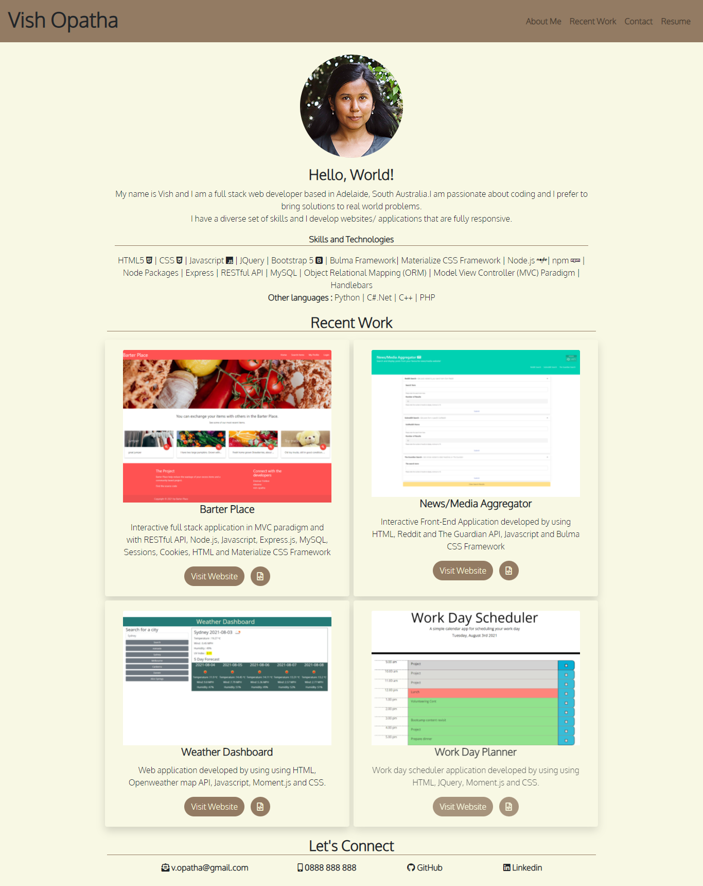

# Web Development Portfolio

## Overview
This is a project carried out to create a portfolio using HTML and Bootstrap framework. This is a responsive design. It provides an introduction , projects done so far, including my contact details. 

## Important Links
Refer to the following links:
* [Web Development Portfolio - Deployed page](https://vish-opatha.github.io/web-development-portfolio/)

* [Web Development Portfolio - Github repository](https://github.com/vish-opatha/web-development-portfolio/)

## Mock-up
The following images show the appearance of the webpage.
* Desktop View

---
* Mobile View

## Technical Acceptance - Work Done
1. The entire portfolio has been revamped using Bootstrap and in mobile-first design.
2. Projects carried out so far have been included in the portfolio.
3. Github repository has been improved according to the given instructions.
4. Linkedin profile has been modified according to the given instructions and alo have submitted to the Career Materials Team.
5. Resume is linked to the portfolio.
7. Application's CSS file is commented to improve readability and code has been refactored as much as possible.

## Deployment - Work Done
1. Application is deployed at live URL using Github pages, and the link is in the "Important links" section.
2. No errors found in loading.
3. Link to the Github URL is given and the repository and it contains the whole code.

## Application Quality - Work Done
1. Deployed page resembls the moke-up in design and functionality.
2. Required functionality is implemented using CSS.

## Repository Quality - Work Done
1. Repository is named as web-development-portfolio.
2. Regarding the folder structure, "Assests" includes seperate folders for CSS,images and documents.
3. Tags are indented accordingly and comments are included while following the best practises for naming conventions.
5. Changes were committed multiple times with messages.

---
Created by Vish Opatha (Last updated on 04 August 2021).

